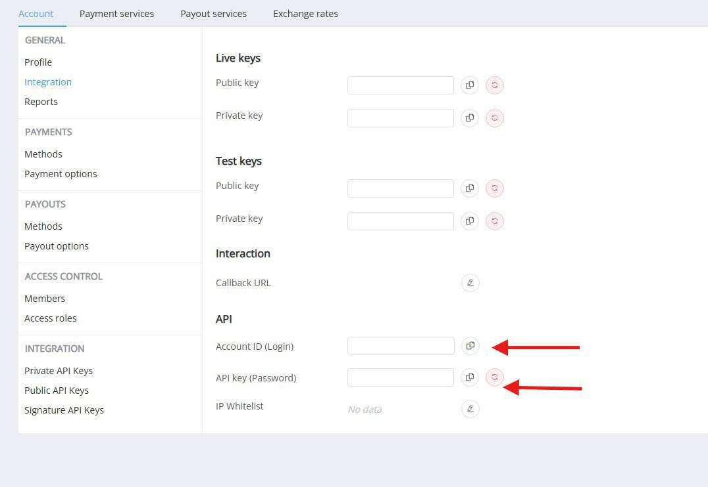

# 🚀 Welcome to AeterEdge!

We’re super excited to have you on board! 🎉  
This quick guide will help you get started with everything you need – fast and hassle-free.

---

## 🔐 Access to the Dashboard

You can log in to your dashboard here:  
👉 [dashboard.aeteredge.com/login](https://dashboard.aeteredge.com/login)

🔑 **Haven’t received your login credentials yet?**  
No worries! Just send me your email and I’ll get them to you right away.

Inside your dashboard, under **Settings > Integration**, you’ll find the credentials for both **test** and **production** environments.

---

## 🧩 Integration Options

### 🖥️ Base Integration (HPP)

📚 For a base integration, you can find all the necessary information here:  
[dashboard.aeteredge.com/docs/en/integration/payments/payment-page](https://dashboard.aeteredge.com/docs/en/integration/payments/payment-page)

### 🔄 Host-to-Host (H2H)

📚 For H2H integration, visit our documentation here:  
[dashboard.aeteredge.com/docs/en/integration/payments/h2h](https://dashboard.aeteredge.com/docs/en/integration/payments/h2h)

### 📬 Callback URL Configuration

📚 If you wish to specify a callback URL or include additional information in the callback, detailed instructions can be found here:  
[dashboard.aeteredge.com/docs/en/integration/callbacks/#configure-callbacks](https://dashboard.aeteredge.com/docs/en/integration/callbacks/#configure-callbacks)

---

## 📡 API Information

**🌐 API URL:**  
📚 The API endpoint is. All payloads should be sent here, regardless if you’re going for the base or H2H integration:  
[https://api.aeteredge.com/](https://api.aeteredge.com/)

**💳 Card Gate URL:**  
📚 The following URL is exclusively for clients who intend to perform an H2H integration and need to send card data in clear:  
[https://checkout.aeteredge.com](https://checkout.aeteredge.com)

**🔒 Private API:**  
📚 We recommend always utilizing flows related to the **Private API** for optimal performance.
[https://dashboard.aeteredge.com/docs/en/integration/#private-api](https://dashboard.aeteredge.com/docs/en/integration/#private-api)

**🔐 Private API Integration**

📌 The URL is [https://api.aeteredge.com/payment-invoices](https://api.aeteredge.com/payment-invoices)  
🔑 Authentication type: **BasicAuth**  
📊 You can view this information in the dashboard under **Settings > Integration**




**🧪 Sandbox & Live Environments:**  
📚 The **same API** is used for both environments.  
To run sandbox transactions, simply include this in your payload:

```json
"test_mode": true
```
